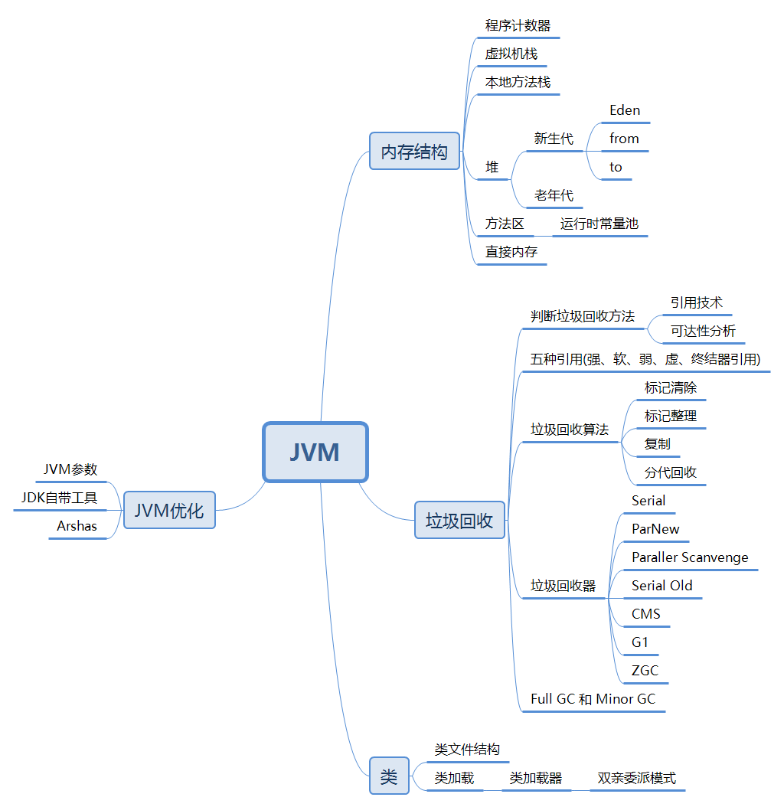
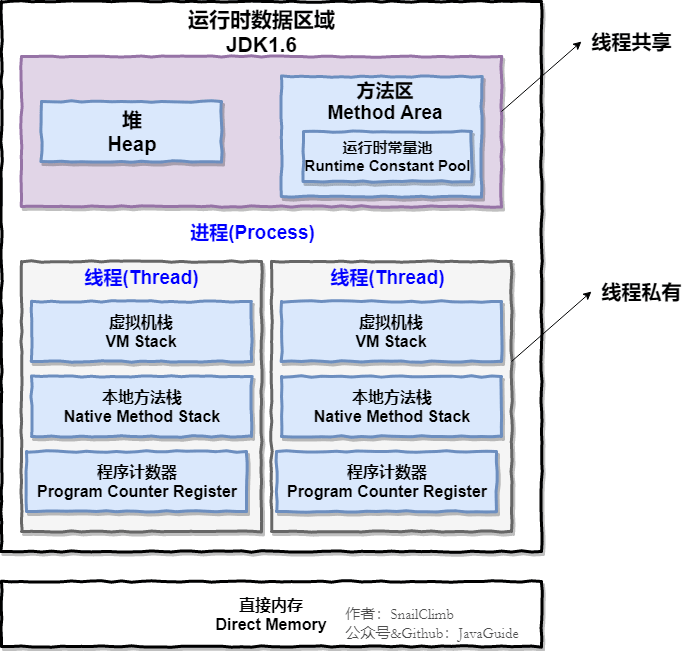
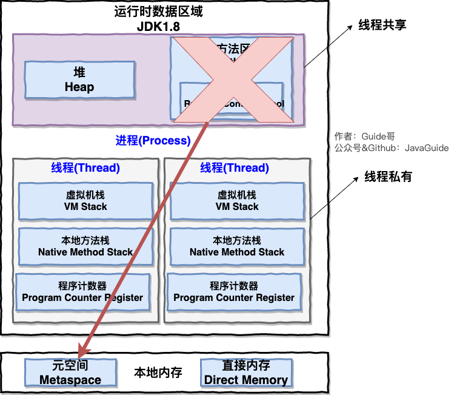

总结

JVM 内存结构

| 内存区域      | 线程私有 | 描述                                                         | 变量                                                         | 异常                                                     | 参数        |
| ------------- | -------- | ------------------------------------------------------------ | ------------------------------------------------------------ | -------------------------------------------------------- | ----------- |
| 程序计数器    | 是       | 记录线程当前执行位置                                         | 无                                                           |                                                          |             |
| Java 虚拟机栈 | 是       | 每一个方法从调用直至执行完成的过程，都对应着一个栈帧在虚拟机栈中入栈和出栈的过程 | 局部变量表（参数）、操作数栈（计算过程中的中间结果）、动态链接方法出口 | StackOverFlowError(栈深度超出最大值) OutOfMemoryError | -XSS 栈深度 |
| 本地方法栈    | 否       | 为虚拟机使用的native方法服务                                 |                                                              | StackOverFlowError OutOfMemoryError                   |             |
| Java 堆       | 否       | 存放对象实例 垃圾回收的主要区域，采用分代收集算法 分为新生代和老年代，新生代在细致一点分为Eden，From Survivor，To Survivor空间 | 实例对象                                                     | OutOfMemoryError(堆中无法为对象实例分配内存且堆无法扩展) |             |
| 方法区        | 否       | 存储已被虚拟机加载的类信息、常量、静态变量、即时编译器编译后的代码等数据，HotSpot 中称之为永久代 | 类信息、常量、静态变量、即时编译器编译后的代码               | OutOfMemoryError                                         |             |
| 运行时常量池  | 否       | 方法区的一部分                                               |                                                              | OutOfMemoryError                                         |             |
| 直接内存      | 否       | 不是运行时区域的一部分，JDK 1.4加入的NIO 它可以使用Native函数库直接分配堆外内存，然后通过Java堆中的DirectByteBuffer对象作为这块内存的引用进行操作 | 运行时产生的字面量和符号引用                                 | OutOfMemoryError                                         |             |

#### 对象在内存中的布局

- 对象头

哈希码、GC 分代年龄、锁状态标识、线程持有的锁、偏向线程id、偏向时间戳等

类型指针：对象指向它的类元数据的指针，虚拟机通过这个指针确定该对象是哪个类的实例，如果对象是数组还会记录数组长度的数据

- 实例数据

对象真正存储的有效信息

- 对齐填充

不是必然存在，占位符作用，HotSpot VM 要求对象起始地址必须是8字节的整数倍

#### 堆中内存分配

新生代和老年代默认比例 1 : 2，新生代分 Eden、From Survivor、To Survivor，默认比例 8 : 1 : 1。

#### 对象的创建过程

 new 对象时，先检查该指令参数是否能在常量池定位到一个类的符号引用，并且检查符号引用代表的类是否已经被加载、解析、初始化。如果没有，先执行类加载过程。

#### 类加载过程

1. 加载：通过类全限定名获取此类的二进制字节流、将字节流代表的静态存储结构转化为方法区的运行时数据结构、在内存中生成代表类的Class对象作为方法去这个类的各种数据的访问入口。
2. 验证：确保Class文件的字节流中包含信息符合当前虚拟机要求，文件格式验证、元数据验证、字节码验证、符号引用验证
3. 准备：为类变量分配内存并蛇者类变量初始值，这些变量的内存都在方法区分配
4. 解析：虚拟机将常量池内的符号引用替换为直接引用的过程
5. 初始化：初始化类变量和其他资源
6. 使用
7. 卸载

### 如何判断对象可回收

- 引用计数算法：为对象加引用计数器，每被引用一次计数器加一，引用失效计数器减一，为零时表示不可用。
- 可达性分析算法：选择 **GC Roots** 对象（虚拟机栈引用对象、方法区类静态属性引用对象、方法区常量引用对象、本地方法栈中JNI引用对象），从这些对象向下搜索，搜索的路径称之为引用链，当对象到 **GC Roots** 没有引用链相连，表示对象不可用，如果对象没有覆盖 `finalize()`方法或者已经执行`finalize()`方法，则对象可回收。

### 内存分配和回收策略

- 对象优先在 Eden 分配
- 大对象直接进入老年代
- 新生代中对象每移动一次年龄计数器加一，达到一定程度（默认15，-XX:MaxTenuringThreshold设置）时进入老年代
- 相同年龄的所有对象内存占用总和达到 Survivor 的一半时，大于或者等于此年龄的对象进入老年代
- 空间分配担保，Minor GC 前如果老年代最大可用连续内存是否大于新生代所有对象总空间，且允许担保失败，如果老年代最大可用连续内存大于历次晋升到老年代对象的平均大小，则尝试 Minor GC，否则 Full GC

### 垃圾回收算法

#### 复制算法

将内存分为两块，每次只使用一块，回收时将存活的对象复制到另一块内存中，然后清除当前使用内存中的全部对象。简单高效，无内存碎片化，但是内存使用率（50%）低。

#### 标记清除

标记出所有需要回收的对象，然后统一回收标记对象。效率低，内存碎片化。

#### 标记整理

标记出所有需要回收的对象，然后将存活对象移动到内存一端，最后清除端边界外的内存。

#### 分代收集算法（最常用）

新生代使用复制算法，老年代使用标记清除或者标记整理。

### GC 类型

- Minor GC 回收年轻代
- Major GC 回收老年代
- Full GC 清理整个堆空间，对暂停所有线程

### 垃圾回收器

| 垃圾收集器        | 区域           | 描述                                                         | 参数                                                         |
| :---------------- | -------------- | ------------------------------------------------------------ | ------------------------------------------------------------ |
| Serial            | 新生代         | 单线程，适合运行在Client模式下的虚拟机来（比如桌面应用）     | -XX:UseSerialGC：使用Serial+Serial Old                       |
| ParNew            | 新生代         | Serial的多线程版本，除了Serial收集器之外，只有它能与CMS收集器配合工作 适合多线程环境，开启收集线程数等于CPU数 | -XX:+UseConcMarkSweepGC 默认使用ParNew -XX:+UseParNewGC 强制指定 -XX:ParallelGCThreads：指定线程数 |
| Parallel Scavenge | 新生代         | 并行收集器，复制算法，关注吞吐量（垃圾回收时间占总时间的比例） | -XX:MaxGCPauseMillis，最大垃圾收集停顿时间，减少GC的停顿时间是以牺牲吞吐量和新生代空间来换取的，不是设置的越小越好 -XX:GCTimeRatio，设置吞吐量大小，值是大于0小于100的范围，相当于吞吐量的倒数，比如设置成99，吞吐量就为1/（1+99）=1% -XX:UseAdaptiveSizePolicy ，这是一个开关参数，打开之后，就不需要设置新生代大小（-Xmn）、Eden和Survival的比例（-XX:SurvivalRatio）、 晋升老年代对象年龄（-XX:PretenureSizeThreshold）等细节参数，收集器会自动调节这些参数 |
| Serial Old        | 老年代         | 单线程，主要意义是在Client模式下的虚拟机使用。在Server端，用于在JDK1.5以及之前版本和Parallel Scavenge配合使用，或者作为CMS的后备预案。 |                                                              |
| Parallel Old      | 老年代         | Parallel Scavenge的老年代版本。在注重吞吐量的场合，都可以优先考虑Parallel Scavenge 和Palallel Old 配合使用 |                                                              |
| CMS               | 老年代         | 以获取最短回收停顿时间为目标的收集器，尤其重视服务的响应速度。基于标记-清除算法实现。 四个步骤进行垃圾回收：初始标记，并发标记，重新标记，并发清除。只有初始标记和重新标记需要停顿 | -XX:CMSInitiatingOccupancyFraction 参数控制触发垃圾回收的阈值 -XX:+UseCMSCompactAtFullColletion 开启碎片整理功能，默认开启 -XX:CMSFullGCsBeforeCompaction，控制多少次不压缩的FullGC之后来一次带压缩的 |
| G1                | 新生代和老年代 | 并行和并发，分代收集，标记-整理，可预测的停顿。 四个步骤：初始标记、并发标记、最终标记、筛选回收 |                                                              |

