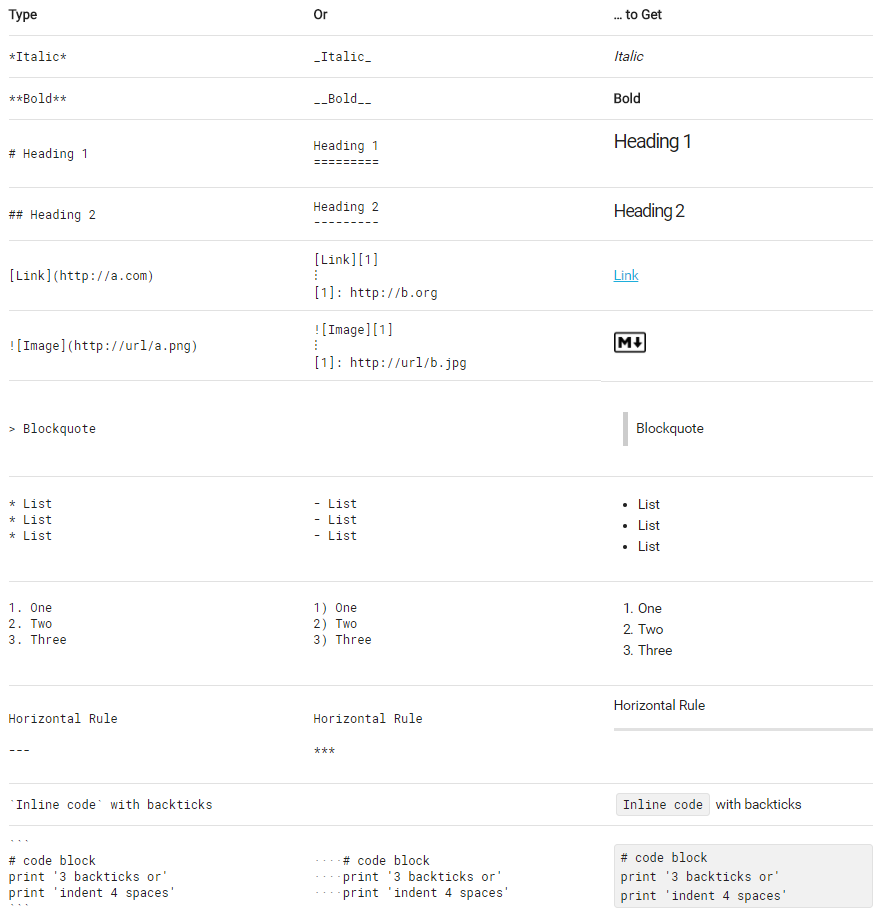
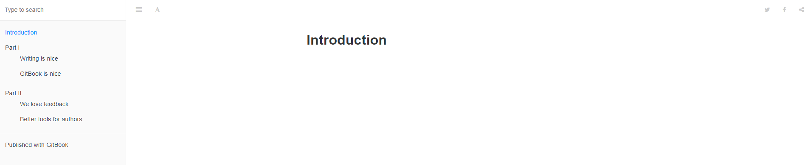
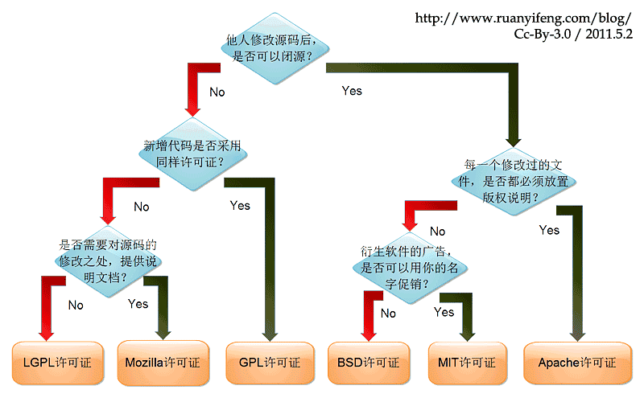
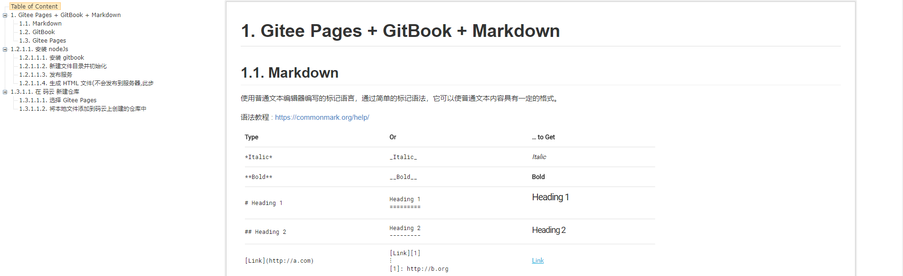

# Gitee Pages + GitBook + Markdown 

## Markdown 

使用普通文本编辑器编写的标记语言，通过简单的标记语法，它可以使普通文本内容具有一定的格式。

语法教程 : [https://commonmark.org/help/](https://commonmark.org/help/)



编辑器推荐 : [Typora](https://www.typora.io/) 

## GitBook

基于 Node.js 的命令行工具，支持 Markdown 和 AsciiDoc 两种语法格式，可以输出 HTML、PDF、eBook 等格式的电子书。

##### 安装 [nodeJs ](https://nodejs.org/en/)

```
> node -v
v10.15.3
```

##### 安装 gitbook

```
npm install gitbook-cli -g
```

检查是否安装成功

```
> gitbook --version
CLI version: 2.3.2
GitBook version: 3.2.3
```

##### 新建文件目录并初始化

```
> mkdir test
> cd test
> gitbook init
warn: no summary file in this book
info: create README.md
info: create SUMMARY.md
info: initialization is finished
```

执行 `gitbook init` 后会在当前目录下生成 `README.md` 和 `SUMMARY.md` 两个文件

- README.md 说明文档
- SUMMARY.md 定义章节和子目录的结构

SUMMARY.md 简单示例如下, 更多参考 [SUMMARY.md](https://github.com/GitbookIO/gitbook/blob/master/docs/pages.md)

```
# Summary

* [Part I](part1/README.md)
    * [Writing is nice](part1/writing.md)
    * [GitBook is nice](part1/gitbook.md)
* [Part II](part2/README.md)
    * [We love feedback](part2/feedback_please.md)
    * [Better tools for authors](part2/better_tools.md)
```

再次执行 `gitbook init` gitbook 会根据 SUMMARY.md 生成章节和子目录文件

```
> gitbook init
info: create part1/README.md
info: create part1/writing.md
info: create part1/gitbook.md
info: create part2/README.md
info: create part2/feedback_please.md
info: create part2/better_tools.md
info: create SUMMARY.md
info: initialization is finished
```

生成目录结构如下:

```
├── README.md
├── SUMMARY.md
├── part1/
|   ├── README.md
|   └── gitbook.md
|   └── writing.md
└── part2/
    ├── README.md
    └── gitbook.md
    └── feedback_please.md
```

##### 发布服务

```
> gitbook serve
Live reload server started on port: 35729
Press CTRL+C to quit ...

info: 7 plugins are installed
info: loading plugin "livereload"... OK
info: loading plugin "highlight"... OK
info: loading plugin "search"... OK
info: loading plugin "lunr"... OK
info: loading plugin "sharing"... OK
info: loading plugin "fontsettings"... OK
info: loading plugin "theme-default"... OK
info: found 1 pages
info: found 3 asset files
info: >> generation finished with success in 1.3s !

Starting server ...
Serving book on http://localhost:4000
```

在浏览器访问 [`http://localhost:4000`](http://localhost:4000)



##### 生成 HTML 文件(不会发布到服务器,此步骤包含在 `gitbook serve` 中)

```
> gitbook build
info: 7 plugins are installed
info: 6 explicitly listed
info: loading plugin "highlight"... OK
info: loading plugin "search"... OK
info: loading plugin "lunr"... OK
info: loading plugin "sharing"... OK
info: loading plugin "fontsettings"... OK
info: loading plugin "theme-default"... OK
info: found 7 pages
info: found 6 asset files
info: >> generation finished with success in 0.6s !
```

生成的 HTML 在 _book 目录下.

参考来源:

- [GitBook 从懵逼到入门](https://blog.csdn.net/lu_embedded/article/details/81100704)
- [GitbookIO/gitbook](https://github.com/GitbookIO/gitbook/blob/master/docs/structure.md)

## Gitee Pages

一个码云提供的支持Jekyll、Hugo、Hexo静态网站的服务.

##### 在 [码云](https://gitee.com) 新建仓库


开源协议选择参考如下:



##### 选择 `Gitee Pages`


启动服务后会显示

```
已开启 Gitee Pages 服务，网站地址： https://{用户名}.gitee.io/{项目名}
```

点击下方的 `暂停` 按钮可以关闭服务.

##### 将本地文件添加到码云上创建的仓库中

在本地新建一个和远程仓库名称一样的目录 blog, 然后初始化

```
> cd blog
> git init
```

添加远程仓库

```
> git remote add origin git@gitee.com:{用户名}/{仓库名}.git
```

同步远程仓库

```
> git pull origin master
```

回到创建的 gitbook 目录下,重新生成 HTML 文件到 blog 下

```
> cd ../test
> gitbook build ./ ../blog/gitbook
```

切到 blog 目录下提交 HTML 文件到远程仓库

```
> cd ../blog
> git add gitbook/
> git commit -m "初始化"
> git push -u origin master
```

重新发布 Gitee Pages 上的服务.

## Other

搜了一下 MarkDown 转 HTML, 发现 GitBook 不是最优解, 操作过程偏复杂, 往往我只是需要将单个 MD 文件转 HTML,  相比于文件导航栏更需要业内导航栏, 使用 GitBook 就需要修改 HTML 文件. 发现以下工具:

- i5ting_toc 

```
> npm install -g i5ting_toc
> i5ting_toc -f yourfile.md
```

生成的 HTML 文件在 preview 目录下, 但是引入的静态文件不会导入该目录下, 需要手动复制, 而且生成的页面风格有点古老.



