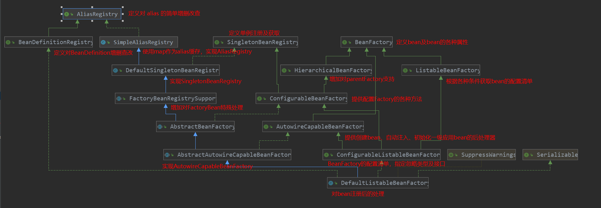
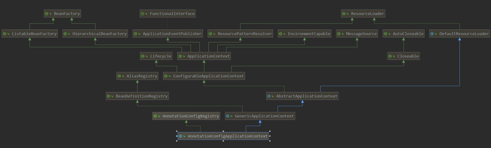

# 观察 @Bean 实例化

##### 目的

观察 @Bean 定义的 bean 是如何实例化的

##### 环境

```shell
jdk 1.8.0_221
spring-boot 2.1.7.RELEASE(对应 spring 版本 5.1.9.RELEASE)
```

##### 项目准备

创建一个基础的 spring-boot 项目

##### 项目结构

```
-- src.main.java
    -- org.oc
        -- BeanConf
        -- Person
        -- SpringDemo
-- pom.xml
```

`pom.xml`

```xml
<parent>
    <groupId>org.springframework.boot</groupId>
    <artifactId>spring-boot-starter-parent</artifactId>
    <version>2.1.7.RELEASE</version>
    <relativePath/>
</parent>

<dependencies>
    <dependency>
        <groupId>org.springframework.boot</groupId>
        <artifactId>spring-boot-starter</artifactId>
    </dependency>
</dependencies>
```

Person.java

```java
public class Person {
    private int id;
    private String name;
    ... ... // 省略 get() 、 set() 、toString()
 }
```

BeanConf.java

```java
@Configuration
public class BeanConf {
    @Bean
    public Person person() {
        Person person = new Person();
        person.setId(1);
        person.setName("tom");
        return person;
    }
}
```

SpringDemo.java

```java
public class SpringDemo {
    public static void main(String[] args) {
        ApplicationContext context = new AnnotationConfigApplicationContext(BeanConf.class);

        Person person = context.getBean(Person.class);

        System.out.println(person);
    }
}
```

### 需要提前了解的概念

在这之前最好了解下 `ApplicationConatext` 和 `BeanFactory` 及其体系

`BeanFactory` 如下图, 此处最重要的类是 `DefaultListableBeanFactory`， `BeanFactory` 的集大成者，通过**组合**的方式在 `ApplicationContext` 中被使用。



`ApplicationContext` 如下,此处 `AnnotationConfigApplicationContext` 是一种基于注解的实现方式,还有 `ClassPathXmlApplicationContext` 和 `FileSystemXmlApplicationContext` 两种基于 XML 解析 bean 方式，二者的差异就是定义和实例化 bean 的方式不同，不展开。



### debug 启动

先看看 `AnnotationConfigApplicationContext(BeanCOnf.class)` 

 ```java
// 一些初始化操作，没什么重要的，略过
// AnnotationConfigApplicationContext 继承了 GenericApplicationContext ，注意 GenericApplicationContext 构造方法中 this.beanFactory = new DefaultListableBeanFactory(); 可以看出虽然 Application 和 BeanFactory 是继承关系，但实际是通过组合的方式使用的
this();
// 获取配置类 BeanConf 的 BeanDefinition 并注册
register(componentClasses);
// 重点关注，refresh() 方法可以手动调用，销毁已存在的容器再创建新容器
refresh();
 ```

进入 `AnnotationConfigApplicationContext.refresh()`

```java
// 同步
synchronized (this.startupShutdownMonitor) {
    // Prepare this context for refreshing.
    // 准备工作，标记容器正在构建
    prepareRefresh();

    // Tell the subclass to refresh the internal bean factory.
    // 得到 this() 中创建的 DefaultListableBeanFactory，不重要
    ConfigurableListableBeanFactory beanFactory = obtainFreshBeanFactory();

    // Prepare the bean factory for use in this context.
    // 忽略一些类，注册几个bean，不重要
    prepareBeanFactory(beanFactory);

    try {
        // Allows post-processing of the bean factory in context subclasses.
        // 空方法，跳过
        postProcessBeanFactory(beanFactory);

        // Invoke factory processors registered as beans in the context.
        // 调用 BeanDefinitionRegistryPostProcessor 实现类的 postProcessBeanDefinitionRegistry 和 postProcessBeanFactory 方法
        // 调用 BeanFactoryPostProcessor 实现类的 postProcessBeanFactory 方法
        invokeBeanFactoryPostProcessors(beanFactory);
    }
... ... 
}
```

进入` org.springframework.context.support.AbstractApplicationContext#invokeBeanFactoryPostProcessors`

```java
PostProcessorRegistrationDelegate.invokeBeanFactoryPostProcessors(beanFactory, getBeanFactoryPostProcessors());
```

进入` org.springframework.context.support.PostProcessorRegistrationDelegate#invokeBeanFactoryPostProcessors`

```java
... ...
// 获取所有 BeanDefinitionRegistryPostProcessor 实现类名称
String[] postProcessorNames = beanFactory.getBeanNamesForType(BeanDefinitionRegistryPostProcessor.class, true, false);    
... ...
// 实例化
    currentRegistryProcessors.add(beanFactory.getBean(ppName, BeanDefinitionRegistryPostProcessor.class));
... ...
// 调用 postProcessBeanDefinitionRegistry 方法
invokeBeanDefinitionRegistryPostProcessors(currentRegistryProcessors, registry);
... ...
// BeanDefinitionRegistryPostProcessor extends BeanFactoryPostProcessor， 所以其实现类也有 postProcessBeanFactory 方法
// 调用 postProcessBeanFactory 方法
invokeBeanFactoryPostProcessors(registryProcessors, beanFactory);
invokeBeanFactoryPostProcessors(regularPostProcessors, beanFactory);
... ...
// 获取所有 BeanFactoryPostProcessor 的实现类名称
String[] postProcessorNames = beanFactory.getBeanNamesForType(BeanFactoryPostProcessor.class, true, false);
... ...
for (String ppName : postProcessorNames) {
    ... ...
    else {
        nonOrderedPostProcessorNames.add(ppName);
    }
}
... ...
List<BeanFactoryPostProcessor> nonOrderedPostProcessors = new ArrayList<>(nonOrderedPostProcessorNames.size());
for (String postProcessorName : nonOrderedPostProcessorNames) {
    // beanFactory.getBean 会实例化 bean，后续详解
    nonOrderedPostProcessors.add(beanFactory.getBean(postProcessorName, BeanFactoryPostProcessor.class));
}
// 实例化 BeanFactoryPostProcessor 的实现类，并调用其 postProcessBeanFactory 方法
invokeBeanFactoryPostProcessors(nonOrderedPostProcessors, beanFactory);
```

`BeanFactoryPostProcessor ` 可以在所有的bean实例化前执行某些操作

回到 `refresh()` 

```java
// Invoke factory processors registered as beans in the context.
invokeBeanFactoryPostProcessors(beanFactory);

// Register bean processors that intercept bean creation.
// 注册并实例化所有的 BeanPostProcessor 的子类
registerBeanPostProcessors(beanFactory);
```

进入 `org.springframework.context.support.AbstractApplicationContext#registerBeanPostProcessors`

```java
protected void registerBeanPostProcessors(ConfigurableListableBeanFactory beanFactory) {
    PostProcessorRegistrationDelegate.registerBeanPostProcessors(beanFactory, this);
}
```

进入 `org.springframework.context.support.PostProcessorRegistrationDelegate#registerBeanPostProcessors`

```java
// 获取 BeanPostProcessor 实现类名称
String[] postProcessorNames = beanFactory.getBeanNamesForType(BeanPostProcessor.class, true, false);

// Separate between BeanPostProcessors that implement PriorityOrdered,
// Ordered, and the rest.
List<BeanPostProcessor> priorityOrderedPostProcessors = new ArrayList<>();
List<BeanPostProcessor> internalPostProcessors = new ArrayList<>();
List<String> orderedPostProcessorNames = new ArrayList<>();
List<String> nonOrderedPostProcessorNames = new ArrayList<>();
for (String ppName : postProcessorNames) {
    if (beanFactory.isTypeMatch(ppName, PriorityOrdered.class)) {
        BeanPostProcessor pp = beanFactory.getBean(ppName, BeanPostProcessor.class);
        priorityOrderedPostProcessors.add(pp);
        if (pp instanceof MergedBeanDefinitionPostProcessor) {
            internalPostProcessors.add(pp);
        }
    }
    else if (beanFactory.isTypeMatch(ppName, Ordered.class)) {
        orderedPostProcessorNames.add(ppName);
    }
    else {
        nonOrderedPostProcessorNames.add(ppName);
    }
}  

// Now, register all regular BeanPostProcessors.
List<BeanPostProcessor> nonOrderedPostProcessors = new ArrayList<>(nonOrderedPostProcessorNames.size());
for (String ppName : nonOrderedPostProcessorNames) {
    // 此处会实例化 bean
    BeanPostProcessor pp = beanFactory.getBean(ppName, BeanPostProcessor.class);
    nonOrderedPostProcessors.add(pp);
    if (pp instanceof MergedBeanDefinitionPostProcessor) {
        internalPostProcessors.add(pp);
    }
}
registerBeanPostProcessors(beanFactory, nonOrderedPostProcessors);
```

#### 注意

如果一个类既实现了 `BeanFactoryPostProcessor` 又实现了 `BeanPostProcessor` 接口，那么 `BeanPostProcessor` 的postProcessBeforeInitialization 和 postProcessAfterInitialization 方法不会被调用，因为这两个方法在实例化对象前后调用，而 `BeanFactoryPostProcessor`  处理在 `BeanPostProcessor` 前，执行`BeanFactoryPostProcessor#postProcessBeanFactory`  时实例化 bean 时，bean 还未被 beanfactory 注册为 BeanPostProcessor，下面的代码里会解释。

回到 `refresh()`

```java
// Initialize message source for this context.
// 略过
initMessageSource();

// Initialize event multicaster for this context.
// 略过
initApplicationEventMulticaster();

// Initialize other special beans in specific context subclasses.
// 空方法，略过
onRefresh();

// Check for listener beans and register them.
// 注册 ApplicationListener 实现类，略过
registerListeners();

// Instantiate all remaining (non-lazy-init) singletons.
// 重点，完成 bean 的实例化
finishBeanFactoryInitialization(beanFactory);

// Last step: publish corresponding event.
// 略过
finishRefresh();
... ...
```

进入 `org.springframework.context.support.AbstractApplicationContext#finishBeanFactoryInitialization`

```java
... ...
// Initialize LoadTimeWeaverAware beans early to allow for registering their transformers early.
// aop 实现
String[] weaverAwareNames = beanFactory.getBeanNamesForType(LoadTimeWeaverAware.class, false, false);
for (String weaverAwareName : weaverAwareNames) {
    getBean(weaverAwareName);
}  

// Stop using the temporary ClassLoader for type matching.
// 略
beanFactory.setTempClassLoader(null);

// Allow for caching all bean definition metadata, not expecting further changes.
// 略
beanFactory.freezeConfiguration();

// Instantiate all remaining (non-lazy-init) singletons.
// 开始初始化了
beanFactory.preInstantiateSingletons();
```

进入 `org.springframework.beans.factory.config.ConfigurableListableBeanFactory#preInstantiateSingletons`

```java
// Iterate over a copy to allow for init methods which in turn register new bean definitions.
// While this may not be part of the regular factory bootstrap, it does otherwise work fine.
List<String> beanNames = new ArrayList<>(this.beanDefinitionNames);

// Trigger initialization of all non-lazy singleton beans...
for (String beanName : beanNames) {
    RootBeanDefinition bd = getMergedLocalBeanDefinition(beanName);
    if (!bd.isAbstract() && bd.isSingleton() && !bd.isLazyInit()) {
        if (isFactoryBean(beanName)) {
            Object bean = getBean(FACTORY_BEAN_PREFIX + beanName);
            if (bean instanceof FactoryBean) {
                final FactoryBean<?> factory = (FactoryBean<?>) bean;
                boolean isEagerInit;
                if (System.getSecurityManager() != null && factory instanceof SmartFactoryBean) {
                    isEagerInit = AccessController.doPrivileged((PrivilegedAction<Boolean>)
                        ((SmartFactoryBean<?>) factory)::isEagerInit,
                        getAccessControlContext());
                }
                else {
                    isEagerInit = (factory instanceof SmartFactoryBean &&
                                   ((SmartFactoryBean<?>) factory).isEagerInit());
                }
                if (isEagerInit) {
                    getBean(beanName);
                }
            }
        }
        else {
            // 进入这
            getBean(beanName);
        }
    }
}

// Trigger post-initialization callback for all applicable beans...
for (String beanName : beanNames) {
    Object singletonInstance = getSingleton(beanName);
    if (singletonInstance instanceof SmartInitializingSingleton) {
        final SmartInitializingSingleton smartSingleton = (SmartInitializingSingleton) singletonInstance;
        if (System.getSecurityManager() != null) {
            AccessController.doPrivileged((PrivilegedAction<Object>) () -> {
                smartSingleton.afterSingletonsInstantiated();
                return null;
            }, getAccessControlContext());
        }
        else {
            smartSingleton.afterSingletonsInstantiated();
        }
    }
}
```

接下来就是创建 bean 的方法 `org.springframework.beans.factory.support.AbstractBeanFactory#getBean(java.lang.String)`

```java
public Object getBean(String name) throws BeansException {
    return doGetBean(name, null, null, false);
}
protected <T> T doGetBean(final String name, @Nullable final Class<T> requiredType,
			@Nullable final Object[] args, boolean typeCheckOnly) throws BeansException {

    final String beanName = transformedBeanName(name);
    Object bean;

    // Eagerly check singleton cache for manually registered singletons.
    // 从缓存中获取 bean，详情见下 代码块1
    Object sharedInstance = getSingleton(beanName);
    if (sharedInstance != null && args == null) {
        ... ...
        bean = getObjectForBeanInstance(sharedInstance, name, beanName, null);
    }

    else {
        // Fail if we're already creating this bean instance:
        // We're assumably within a circular reference.
        if (isPrototypeCurrentlyInCreation(beanName)) {
            throw new BeanCurrentlyInCreationException(beanName);
        }

        // Check if bean definition exists in this factory.
        // person 会进入下面代码片段，beanConf 会跳过
        BeanFactory parentBeanFactory = getParentBeanFactory();
        if (parentBeanFactory != null && !containsBeanDefinition(beanName)) {
            // Not found -> check parent.
            String nameToLookup = originalBeanName(name);
            if (parentBeanFactory instanceof AbstractBeanFactory) {
                return ((AbstractBeanFactory) parentBeanFactory).doGetBean(
                    nameToLookup, requiredType, args, typeCheckOnly);
            }
            else if (args != null) {
                // Delegation to parent with explicit args.
                return (T) parentBeanFactory.getBean(nameToLookup, args);
            }
            else if (requiredType != null) {
                // No args -> delegate to standard getBean method.
                return parentBeanFactory.getBean(nameToLookup, requiredType);
            }
            else {
                return (T) parentBeanFactory.getBean(nameToLookup);
            }
        }

        if (!typeCheckOnly) {
            markBeanAsCreated(beanName);
        }

        try {
            final RootBeanDefinition mbd = getMergedLocalBeanDefinition(beanName);
            // 检查是不是抽象类
            checkMergedBeanDefinition(mbd, beanName, args);

            // Guarantee initialization of beans that the current bean depends on.
            // 检查循环 depend-on
            //depend-on 互相depend-on 的两个 bean
            // 1. 创建 beanA
            // 2. 获取 beanA depend-on 的 beanB
            // 3. 判断 beanB 是否 depend-on beanA，是则抛异常，第一次运行到这时不满足
            // 4. 记录 beanA depend-on beanB
            // 5. 实例化 beanB
            // 6. 获取 beanB depedn-on 的 beanA
            // 7. 判断 beanA 是否 depend-on beanB ，第4步指定了 beanA depend-on beanB， 所以此处抛异常
            String[] dependsOn = mbd.getDependsOn();
            if (dependsOn != null) {
                for (String dep : dependsOn) {
                    if (isDependent(beanName, dep)) {
                        throw new BeanCreationException(mbd.getResourceDescription(), beanName,
"Circular depends-on relationship between '" + beanName + "' and '" + dep + "'");
                    }
                    registerDependentBean(dep, beanName);
                    try {
                        getBean(dep);
                    } catch (NoSuchBeanDefinitionException ex) {
                        throw new BeanCreationException(mbd.getResourceDescription(), beanName,
"'" + beanName + "' depends on missing bean '" + dep + "'", ex);
                    }
                }
            }

            // Create bean instance.
            // 单例进入当前分支，详情见代码块2
            if (mbd.isSingleton()) {
                sharedInstance = getSingleton(beanName, () -> {
                    try {
                        // 
                        return createBean(beanName, mbd, args);
                    }
                    catch (BeansException ex) {
                   // Explicitly remove instance from singleton cache: It might have been put there
                   // eagerly by the creation process, to allow for circular reference resolution.
                   // Also remove any beans that received a temporary reference to the bean.
                        destroySingleton(beanName);
                        throw ex;
                    }
                });
                bean = getObjectForBeanInstance(sharedInstance, name, beanName, mbd);
            }
		   // 多例进入这个分支	
            else if (mbd.isPrototype()) {
                // It's a prototype -> create a new instance.
                Object prototypeInstance = null;
                try {
                    beforePrototypeCreation(beanName);
                    prototypeInstance = createBean(beanName, mbd, args);
                }
                finally {
                    afterPrototypeCreation(beanName);
                }
                bean = getObjectForBeanInstance(prototypeInstance, name, beanName, mbd);
            }
            // 其他 scope 为 request、session 等进入这个分支
            else {
                String scopeName = mbd.getScope();
                final Scope scope = this.scopes.get(scopeName);
                if (scope == null) {
                    throw new IllegalStateException("No Scope registered for scope name '" + scopeName + "'");
                }
                try {
                    Object scopedInstance = scope.get(beanName, () -> {
                        beforePrototypeCreation(beanName);
                        try {
                            return createBean(beanName, mbd, args);
                        }
                        finally {
                            afterPrototypeCreation(beanName);
                        }
                    });
                    bean = getObjectForBeanInstance(scopedInstance, name, beanName, mbd);
                }
                catch (IllegalStateException ex) {
                    throw new BeanCreationException(beanName,
   "Scope '" + scopeName + "' is not active for the current thread; consider " +
   "defining a scoped proxy for this bean if you intend to refer to it from a singleton",ex);
                }
            }
        }
        catch (BeansException ex) {
            cleanupAfterBeanCreationFailure(beanName);
            throw ex;
        }
    }

    // Check if required type matches the type of the actual bean instance.
    if (requiredType != null && !requiredType.isInstance(bean)) {
            // 转换 bean 类型
            T convertedBean = getTypeConverter().convertIfNecessary(bean, requiredType);
    }
  ... ...
    return (T) bean;
}
```

##### 代码块 1

从缓存中获取 bean ，`org.springframework.beans.factory.support.DefaultSingletonBeanRegistry#getSingleton(java.lang.String)`

```java
@Nullable
public Object getSingleton(String beanName) {
    return getSingleton(beanName, true);
}

protected Object getSingleton(String beanName, boolean allowEarlyReference) {
    Object singletonObject = this.singletonObjects.get(beanName);
    // 如果缓存中不存在且 bean 被标识为正在创建中
    if (singletonObject == null && isSingletonCurrentlyInCreation(beanName)) {
        synchronized (this.singletonObjects) {
            singletonObject = this.earlySingletonObjects.get(beanName);
            if (singletonObject == null && allowEarlyReference) {
                ObjectFactory<?> singletonFactory = this.singletonFactories.get(beanName);
                if (singletonFactory != null) {
                    // 从缓存中的 factoryBean 中获取 bean 后删除 factoryBean 缓存并添加 bean 到缓存
                    singletonObject = singletonFactory.getObject();
                    this.earlySingletonObjects.put(beanName, singletonObject);
                    this.singletonFactories.remove(beanName);
                }
            }
        }
    }
    return singletonObject;
}
```

##### 代码块 2

创建单例，进入 `org.springframework.beans.factory.support.DefaultSingletonBeanRegistry#getSingleton(java.lang.String, org.springframework.beans.factory.ObjectFactory<?>)`

```java
synchronized (this.singletonObjects) {
    // 从缓存中获取
    Object singletonObject = this.singletonObjects.get(beanName);
    if (singletonObject == null) {
        ... ...
        // 标记当前 bean 正在创建
        beforeSingletonCreation(beanName);
        ... ...
            // 此处返回上方的代码org.springframework.beans.factory.support.AbstractBeanFactory#createBean
            singletonObject = singletonFactory.getObject();
        ... ...
            // 标记当前 bean 已经完成
            afterSingletonCreation(beanName);
        }
        if (newSingleton) {
            // 添加缓存
            addSingleton(beanName, singletonObject);
        }
    }
    return singletonObject;
}
```

进入 `org.springframework.beans.factory.support.AbstractBeanFactory#createBean`

```java
... ...
Object beanInstance = doCreateBean(beanName, mbdToUse, args);
... ...
```

进入 `org.springframework.beans.factory.support.AbstractAutowireCapableBeanFactory#doCreateBean`

```java
// Instantiate the bean.
BeanWrapper instanceWrapper = null;
if (mbd.isSingleton()) {
    instanceWrapper = this.factoryBeanInstanceCache.remove(beanName);
}
if (instanceWrapper == null) {
    // 创建 bean
    instanceWrapper = createBeanInstance(beanName, mbd, args);
}
```

进入 `org.springframework.beans.factory.support.AbstractAutowireCapableBeanFactory#createBeanInstance`

```java
// person 实例化在此处
if (mbd.getFactoryMethodName() != null) {
    return instantiateUsingFactoryMethod(beanName, mbd, args);
}
... ...
// Candidate constructors for autowiring?
// @autowiring 注入的
Constructor<?>[] ctors = determineConstructorsFromBeanPostProcessors(beanClass, beanName);
if (ctors != null || mbd.getResolvedAutowireMode() == AUTOWIRE_CONSTRUCTOR ||
    mbd.hasConstructorArgumentValues() || !ObjectUtils.isEmpty(args)) {
    return autowireConstructor(beanName, mbd, ctors, args);
}

// Preferred constructors for default construction?
ctors = mbd.getPreferredConstructors();
if (ctors != null) {
    return autowireConstructor(beanName, mbd, ctors, null);
}

// No special handling: simply use no-arg constructor.
// bennConf 实例化进入此处
return instantiateBean(beanName, mbd);
```

beanConf 先实例化

进入 `org.springframework.beans.factory.support.AbstractAutowireCapableBeanFactory#instantiateBean`

```java
Object beanInstance;
final BeanFactory parent = this;
if (System.getSecurityManager() != null) {
    beanInstance = AccessController.doPrivileged((PrivilegedAction<Object>) () ->
    getInstantiationStrategy().instantiate(mbd, beanName, parent), getAccessControlContext());
}
else {
    // 进入 instantiate
    beanInstance = getInstantiationStrategy().instantiate(mbd, beanName, parent);
}
BeanWrapper bw = new BeanWrapperImpl(beanInstance);
initBeanWrapper(bw);
return bw;
```

进入 `org.springframework.beans.factory.support.InstantiationStrategy#instantiate(org.springframework.beans.factory.support.RootBeanDefinition, java.lang.String, org.springframework.beans.factory.BeanFactory)`

```java
// Don't override the class with CGLIB if no overrides.
// 有方法重写，即实现了接口则使用JDK代理，否则使用CGLIB
if (!bd.hasMethodOverrides()) {
    Constructor<?> constructorToUse;
    synchronized (bd.constructorArgumentLock) {
        constructorToUse = (Constructor<?>) bd.resolvedConstructorOrFactoryMethod;
        if (constructorToUse == null) {
            final Class<?> clazz = bd.getBeanClass();
            if (clazz.isInterface()) {
                throw new BeanInstantiationException(clazz, "Specified class is an interface");
            }
            try {
                if (System.getSecurityManager() != null) {
                    constructorToUse = AccessController.doPrivileged(
                        (PrivilegedExceptionAction<Constructor<?>>) clazz::getDeclaredConstructor);
                }
                else {
                    constructorToUse = clazz.getDeclaredConstructor();
                }
                bd.resolvedConstructorOrFactoryMethod = constructorToUse;
            }
            catch (Throwable ex) {
                throw new BeanInstantiationException(clazz, "No default constructor found", ex);
            }
        }
    }
    return BeanUtils.instantiateClass(constructorToUse);
}
else {
    // Must generate CGLIB subclass.
    return instantiateWithMethodInjection(bd, beanName, owner);
}
```

JDK 代理 `org.springframework.beans.BeanUtils#instantiateClass(java.lang.reflect.Constructor<T>, java.lang.Object...)`

```java
Class<?>[] parameterTypes = ctor.getParameterTypes();
Object[] argsWithDefaultValues = new Object[args.length];
for (int i = 0 ; i < args.length; i++) {
    if (args[i] == null) {
        Class<?> parameterType = parameterTypes[i];
        argsWithDefaultValues[i] = (parameterType.isPrimitive() ? DEFAULT_TYPE_VALUES.get(parameterType) : null);
    } else {
        argsWithDefaultValues[i] = args[i];
    }
}
return ctor.newInstance(argsWithDefaultValues);
```

进入 `java.lang.reflect.Constructor#newInstance`

```java
// 反射创建实例
T inst = (T) ca.newInstance(initargs);
```

现在进入实例化person 的分支

`org.springframework.beans.factory.support.AbstractAutowireCapableBeanFactory#instantiateUsingFactoryMethod`

```java
return new ConstructorResolver(this).instantiateUsingFactoryMethod(beanName, mbd, explicitArgs);
```

进入 `org.springframework.beans.factory.support.ConstructorResolver#instantiateUsingFactoryMethod`

```java
String factoryBeanName = mbd.getFactoryBeanName();
factoryBean = this.beanFactory.getBean(factoryBeanName);
... ...
bw.setBeanInstance(instantiate(beanName, mbd, factoryBean, uniqueCandidate, EMPTY_ARGS));
```

进入 `org.springframework.beans.factory.support.ConstructorResolver#instantiate(java.lang.String, org.springframework.beans.factory.support.RootBeanDefinition, java.lang.Object, java.lang.reflect.Method, java.lang.Object[])`

```java
return this.beanFactory.getInstantiationStrategy().instantiate(
	mbd, beanName, this.beanFactory, factoryBean, factoryMethod, args);
```

进入 `org.springframework.beans.factory.support.InstantiationStrategy#instantiate(org.springframework.beans.factory.support.RootBeanDefinition, java.lang.String, org.springframework.beans.factory.BeanFactory, java.lang.Object, java.lang.reflect.Method, java.lang.Object...)`

```java
// 通过反射调用 beanConf 的 person 方法
Object result = factoryMethod.invoke(factoryBean, args);
```

### 总结

beanConf 是通过反射实例化的

person 也是通过反射调用 beanConf 的 person()  方法实例化的
