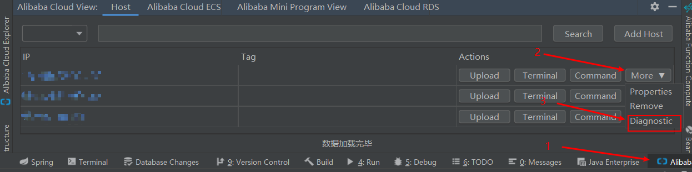

# Arthas(阿尔萨斯)

arthas 是阿里出的 Java 诊断工具，可以在线排查问题，动态追踪 Java 代码，实时监控 JVM 状态。

> Github https://github.com/alibaba/arthas
>
> 官方教程 https://alibaba.github.io/arthas/arthas-tutorials?language=cn&id=arthas-basics
>
> 文档 https://alibaba.github.io/arthas/

Alibaba Cloud Toolkit 插件已经提供了 Arthas  快捷方式,如图点击后进入 arthas 。

Alibabs Cloud Toolkit  -> 选定服务器，点击 More -> Diagnositc 



官方教程已经覆盖了主要功能，此处仅记录常用的几个功能点，方便平时排查问题。

#### 小技巧

> `-h` 查看帮助信息
>
> `Tab` 自动补全
>
> `ctrl + A` 跳转行首
>
> `ctrl + E` 跳转行尾
>
> `up` `down` 匹配历史命令
>
> 善用管道命令 `grep` `wc`

#### 注意

>以下涉及条件表达式处均指 `ognl`  [参考](https://commons.apache.org/proper/commons-ognl/language-guide.html)

### dashboard 实时数据面板

```
[arthas@9161]$ dashboard
ID               NAME                                             GROUP                            PRIORITY         STATE           %CPU             TIME            INTERRUPTED      DAEMON          
27               Timer-for-arthas-dashboard-c60f3500-d12f-44da-b2 system                           10               RUNNABLE        100              0:0             false            true            
10               AsyncAppender-Worker-arthas-cache.result.AsyncAp system                           9                WAITING         0                0:0             false            true            
8                Attach Listener                                  system                           9                RUNNABLE        0                0:0             false            true            
3                Finalizer                                        system                           8                WAITING         0                0:0             false            true            
2                Reference Handler                                system                           10               WAITING         0                0:0             false            true            
4                Signal Dispatcher                                system                           9                RUNNABLE        0                0:0             false            true            
26               as-command-execute-daemon                        system                           10               TIMED_WAITING   0                0:0             false            true            
Memory                                    used           total         max           usage         GC                                                                                                 
heap                                      34M            49M           444M          7.71%         gc.copy.count                                     23                                               
eden_space                                4M             13M           122M          3.63%         gc.copy.time(ms)                                  141                                              
survivor_space                            553K           1728K         15680K        3.53%         gc.marksweepcompact.count                         1                                                
Runtime                                                                                                                                                                                               
os.name                                                                                            Linux                                                                                              
os.version                                                                                         3.10.0-514.26.2.el7.x86_64                                                                         
java.version                                                                                       1.8.0_232                  
```

#### 数据说明

- ID: Java级别的线程ID，注意这个ID不能跟jstack中的nativeID一一对应
- NAME: 线程名
- GROUP: 线程组名
- PRIORITY: 线程优先级, 1~10之间的数字，越大表示优先级越高
- STATE: 线程的状态
- CPU%: 线程消耗的cpu占比，采样100ms，将所有线程在这100ms内的cpu使用量求和，再算出每个线程的cpu使用占比。
- TIME: 线程运行总时间，数据格式为`分：秒`
- INTERRUPTED: 线程当前的中断位状态
- DAEMON: 是否是daemon线程

### thread 打印线程信息

> https://alibaba.github.io/arthas/thread.html

| 参数名称    | 参数说明                              |
| ----------- | ------------------------------------- |
| *id*        | 线程id                                |
| [n:]        | 指定最忙的前N个线程并打印堆栈         |
| [b]         | 找出当前阻塞其他线程的线程            |
| [i <value>] | 指定cpu占比统计的采样间隔，单位为毫秒 |

```shell
> thread 显示全部线程
> thread -n 3 显示CPU占比最高的三个线程
> thread -b 查看阻塞线程
> thread -i 100 指定采样间隔100毫秒
> thread [id] 查看指定id 的线程
```

### stack 查看方法被调用链

> https://alibaba.github.io/arthas/stack.html

| 参数名称            | 参数说明                             |
| ------------------- | ------------------------------------ |
| *class-pattern*     | 类名表达式匹配                       |
| *method-pattern*    | 方法名表达式匹配                     |
| *condition-express* | 条件表达式                           |
| [E]                 | 开启正则表达式匹配，默认为通配符匹配 |
| `[n:]`              | 执行次数限制                         |

```shell
>  stack demo.MathGame primeFactors 查看`primeFactors` 的被调用链
>  stack demo.MathGame primeFactors 'params[0]<0' -n 2 查看第一个参数小于0时的方法被调用链
>  stack demo.MathGame primeFactors '#cost>5' 根据耗时大于5毫秒过滤
```

### trace 查看方法调用链

> https://alibaba.github.io/arthas/trace.html

| 参数名称            | 参数说明                             |
| ------------------- | ------------------------------------ |
| *class-pattern*     | 类名表达式匹配                       |
| *method-pattern*    | 方法名表达式匹配                     |
| *condition-express* | 条件表达式，{params,returnObj}       |
| [E]                 | 开启正则表达式匹配，默认为通配符匹配 |
| `[n:]`              | 命令执行次数                         |
| `#cost`             | 方法执行耗时                         |

调用链中会显示每个方法的执行时间，可以排查某个响应时间长的接口在哪个方法耗时过久。

很多时候我们只想看到某个方法的rt大于某个时间之后的trace结果，现在Arthas可以按照方法执行的耗时来进行过滤了，例如`trace *StringUtils isBlank '#cost>100'`表示当执行时间超过100ms的时候，才会输出trace的结果。

```shell
> trace [-E] [class-pattern] [method-pattern] [condition-express] [-n num]
> trace demo.MathGame * 查看demo.MathGame类的任意方法调用链
> trace demo.MathGame * -n 1 查看demo.MathGame类的任意方法调用链，捕获一次数据后退出
> trace demo.MathGame run '#cost > 10' 查看demo.MathGame类的`run`方法调用链,只展示耗时大于10ms的调用路径
> trace -E demo.MathGame|demo.MathGameB method1|method2 查看多个类中多个方法的调用链 
```

`--skipJDKMethod  ` skip jdk method trace, default value true.

默认情况下，trace不会包含jdk里的函数调用，如果希望trace jdk里的函数，需要显式设置`--skipJDKMethod false`

### watch 查看方法参数、返回值、异常等

> https://alibaba.github.io/arthas/watch.html

| 参数名称            | 参数说明                                   |
| ------------------- | ------------------------------------------ |
| *class-pattern*     | 类名表达式匹配                             |
| *method-pattern*    | 方法名表达式匹配                           |
| *express*           | 观察表达式                                 |
| *condition-express* | 条件表达式                                 |
| [b]                 | 在**方法调用之前**观察                     |
| [e]                 | 在**方法异常之后**观察                     |
| [s]                 | 在**方法返回之后**观察                     |
| [f]                 | 在**方法结束之后**(正常返回和异常返回)观察 |
| [E]                 | 开启正则表达式匹配，默认为通配符匹配       |
| [x:]                | 指定输出结果的属性遍历深度，默认为 1       |

```shell
> watch demo.MathGame primeFactors "{params,returnObj}" -x 2 查看类`demo.MathGame`的方法`primeFactors` 的参数和返回值，参数、返回值展示深度为2
> watch demo.MathGame primeFactors "{params[0],target}" "params[0]<0" 查看第一个参数小于0时的的参数和目标类
```

### tt 记录指定发放每次调用的入参、返回信息、耗时

> https://alibaba.github.io/arthas/tt.html

| 参数名称 | 参数说明                   |
| -------- | -------------------------- |
| [t]      | 记录方法每次调用的执行情况 |
| [n]      | 指定次数                   |
| [i]      | 显示详情                   |

```shell
> tt -t *Test print params.length==1 解决方法重载-指定参数个数
> tt -t *Test print 'params[1] instanceof Integer' 解决方法重载-指定参数类型
> tt -t *Test print params[0].mobile=="13989838402" 指定参数值
> tt -s 'method.name=="primeFactors"' 指定方法名称
> tt -i 1000 显示详情
> tt -i 1000 -p 重新执行一次 INDEX 为 1000 的请求
> tt -i 1000 -w 'target.getApplicationContext().getBean("helloWorldService").getHelloMessage()' 获取 spring bean，并调用函数
```

